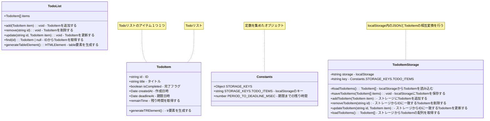

```mermaid
classDiagram

    note for TodoItem "Todoリストのアイテム１つ１つ"

    class TodoItem {
        +string id - ID
        +string title - タイトル
        +boolean isCompleted - 完了フラグ
        +Date createdAt - 作成日時
        +Date deadlineAt - 期限日時
        +remainTime - 残り時間を取得する
        +generateTRElement() - tr要素を生成する
    }

    note for TodoItem "Todoリスト"

    class TodoList {
        +TodoItem[] items
        +add(TodoItem item) : void - TodoItemを追加する
        +remove(string id) : void - TodoItemを削除する
        +update(string id, TodoItem item) : void - TodoItemを更新する
        +find(id) : TodoItem | null - IDからTodoItemを取得する
        +generateTableElement() : HTMLElement - table要素を生成する
    }

    note for Constants "定数を集めたオブジェクト"

    class Constants {
        +Object STORAGE_KEYS
        +string STORAGE_KEYS.TODO_ITEMS - localStorageのキー
        +number PERIOD_TO_DEADLINE_MSEC - 期限までの残り時間
    }

    note for TodoItemStorage "localStorage内のJSONとTodoItemの相互変換を行う"

    class TodoItemStorage {
        -#string storage - localStorage
        -#string key - Constants.STORAGE_KEYS.TODO_ITEMS
        -#loadTodoItems() : TodoItem[] - localStorageからTodoItemを読み込む
        -#saveTodoItems(TodoItem[] items) : void - localStorageにTodoItemを保存する
        +addTodoItem(TodoItem item) - ストレージにTodoItemを追加する
        +removeTodoItem(string id) - ストレージからIDに一致するTodoItemを削除する
        +updateTodoItem(string id, TodoItem item) - ストレージからIDに一致するTodoItemを更新する
        +loadTodoItems() : TodoItem[] - ストレージからTodoItemの配列を取得する
    }
```